[toc]


**在 GitHub 上阅读本文，目录查看按钮在左上角**

**使用本主题时，发现 Bug，请升级至 See Yue 主题最新版本。若处于最新版本，Bug 仍然存在，请提 Issues，我会及时解决。**

> **如何查看当前使用的 See Yue 主题版本号？**
>
> 请看 `see-yue.css` 文件首行（v1.3.3 版本添加） / `README.md` 文件。

## 1.1 主题使用

1、下载右侧的 `Releases` 最新压缩包。

2、解压后的 ==SeeYue 文件夹== 和 ==see-yue-xxxx.css 文件==**直接**放入 Typora 的 `themes` 文件夹。

3、重启 Typora，主题选择 `See Yue xxxx` ，开始愉快地写作！

> 如果你使用的是 See Yue v1.3.x，建议你直接使用  See Yue v1.4.0。 See Yue v1.4.0 相较于 See Yue v1.3.x，改动非常大。

蓝奏云下载链接： https://xianchengyue.lanzout.com/b027inxfe ，密码：1234。打不开，将 `lanzout` 换成 `lanzoui` / `lanzous` / `lanzoux` 。

> 使用本主题时，界面工具栏是黑色的，做如下设置。
>
> 「文件」→「偏好设置」→「外观」→「**勾选**在深色模式下使用独立的主题」

## 1.2 主题介绍

- See Yue 系列主题是一个自定义样式极多、简约、充满细节的 Typora 主题。
- See Yue 系列主题针对**中文**做了优化。See Yue 可译为**望月**。
- See Yue 系列主题有着详细的注释，非常利于用户自定义。

|     主题     | 说明                                                         |
| :----------: | ------------------------------------------------------------ |
| See Yue Dark | 暗黑主题，配色参考 [Nord (nordtheme.com)](https://www.nordtheme.com/) |
| See Yue Pure | 明亮主题，尽可能使用「黑白灰」三色。适合导出 PDF             |
| See Yue Salt | 护眼主题（主观），使用颜色较多（较乱）。属于缝合怪           |

作者对三个主题的满意程度：See Yue Dark ≈ See Yue Pure ＞ See Yue Salt。

**参考**

- [Nord (nordtheme.com)](https://www.nordtheme.com/) 
- [TDesign - 开源的企业级设计体系 (tencent.com)](https://tdesign.tencent.com/)
- [Ant Design - 一套企业级 UI 设计语言和 React 组件库](https://ant.design/index-cn) 
- [ChristosBouronikos/typora-nord-theme](https://github.com/ChristosBouronikos/typora-nord-theme) 

### 1.2.1 设计思路

**1、字体**

开发者将 Typora 界面分为两部分：写作区、侧边栏。

- 写作区分为正文、目录、标题。
  - 正文使用 [HarmonyOS Sans](https://developer.harmonyos.com/cn/docs/design/font-0000001157868583) + [HarmonyOS-Regular](https://developer.harmonyos.com/cn/docs/design/font-0000001157868583) 。
  - 正文目录使用 HarmonyOS Sans +  [汉仪玄宋 45S](https://www.hanyi.com.cn/productdetail?id=8216) 。
  - 标题、加粗文本使用 HarmonyOS-Bold。
  - 引用块使用 HarmonyOS Sans + [LxgwWenKai-Screen ](https://github.com/lxgw/LxgwWenKai-Screen)。
- 侧边栏、右键菜单、底部栏使用 HarmonyOS Sans + LxgwWenKai-Screen。

**2、色彩**

See Yue 主题在色彩的选用上比较克制。

- See Yue Dark：主要使用蓝色、绿色、深紫色
- See Yue Pure：主要使用黑白灰、蓝色。
- See Yue Salt：主要使用蓝色、绿色、橙色

**3、整体界面**

个人比较喜欢圆润的风格，看起来比较舒服。

- 按钮、hover 底色圆角化。
- 文本样式底色统一圆角化。
- 表格、图片圆角化。
- 鼠标滚轮圆角化。

圆角大法好！ 🤣

### 1.2.2 注意

- See Yue 主题是我学习 CSS 的练手之作，代码风格可能极其不规范。不过大部分代码，作者都写了注释，应该还是比较好理解的。
- 本主题仅在 Windows 上做过测试，不保证在 Mac 上可以达到相同效果。如果在 Mac 上出现问题，请提 `Issues` ，作者会尽量修复。
- 使用 See Yue Dark 主题，设置界面会带有一些主题的样式，问题不大。懒得修复。

## 1.3 主题文件

由于主题功能多，资源文件、代码文件较多。为便于使用者修改，开发者将代码分割成不同的 CSS 文件，每一份 CSS 文件都有着独立且不同的功能。

`see-yue-dark.css`、`see-yue-pure.css`、`see-yue-salt.css` 文件为主题**主体文件**。

SeeYue 文件夹存放主题的「代码文件」、「资源文件」 ，SeeYue 文件夹的详细介绍请看 https://www.zhixi.com/view/d0ef7d52 / `SeeYue 文件夹内容介绍.png` 。

## 1.4 主题功能

### 1.4.1 长代码滚动显示

相关代码在 `code-block.css` 文件。

**1、代码块任一行横向滚动**

此功能默认开启。

关闭方法：`xxxx-configs.css` 搜索 **--code-block-lines-horizontal-white-space**，按注释操作。

```css
  /* 是否开启代码块任意行横向滚动，是 —— pre，否 —— normal  */
  --code-block-lines-horizontal-white-space: normal;
  --code-block-lines-horizontal-overflow-x : auto;
```

**2、代码块纵向滚动**

此功能默认开启。

调整代码块高度，在 `xxxx-configs.css`：搜索 **--code-block-max-height**，按注释操作。

效果如下：

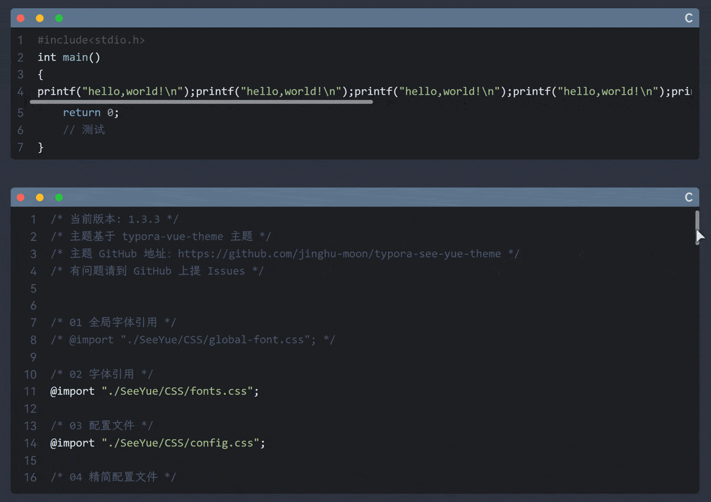

### 1.4.2 代码块显示编程语言

相关代码在 `code-lang.css` 、`top-bar.css` 文件。

注意：`code-lang.css` 、`top-bar.css` 不能能同时使用。

效果：

1、使用 `top-bar.css` 

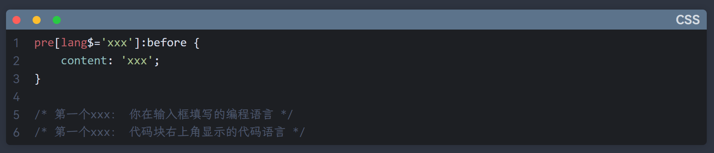


2、使用 `code-lang.css` 

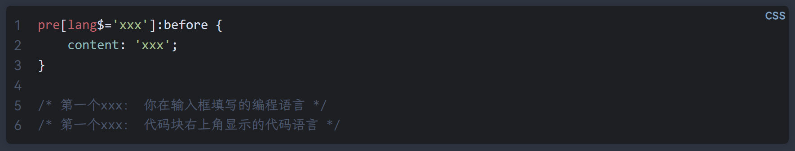

代码块会自动在右上角显示你选择的编程语言。如果没有显示，有两种可能。


1. 选择代码块语言时，是自己输入的字符，不能被识别。建议在输入框选择自己的代码语言。

2. CSS 文件没有添加该编程语言。可以在 `code-lang-lists.css` 文件添加相应代码。

   添加方式如下：

   ````css
   pre[lang$='xxx']:before {
       content: 'xxx';
   }
   
   /* 第一个xxx： 你在输入框填写的编程语言 */
   /* 第一个xxx： 代码块右上角显示的代码语言 */
   ````

PS：开发者已经将输入框显示的所有编程语言写入了 `code-lang-lists.css` 文件，应该不会存在第二种情况。

### 1.4.3 图片编号+图释

相关代码在 `images.css` 、`images-number.css` 文件。

CSS 代码可以实现图片自动编号，但要正确显示图释（ `alt` 属性值），需要修改 **frame.js** 源码

 **frame.js** 位于 Typora/resources/appsrc/window 路径下。

修改方式见下：

Typora v0.9.98

```js
h="<span md-inline='"+v+"'"+S+" contenteditable='false' class='md-image"+L+"' data-src='"+F+"' "+b+">
h="<span md-inline='"+v+"'"+S+" contenteditable='false' class='md-image md-img-loaded"+w+"' "+b+">
/* 将末尾 "> 替换为第四行代码 */
" alt='"+ (k.getAttribute("alt") ? ". "+(/^(shadow-|blur-|gray-)?(.*)$/.exec(k.getAttribute("alt"))[2]) : "") +"'>
```

Typora v1.4.7 及以上

```js
s="<span md-inline='"+g+"'"+S+" contenteditable='false' class='md-image"+L+"' data-src='"+k+"' "+b+">
s="<span md-inline='"+g+"'"+S+" contenteditable='false' class='md-image md-img-loaded"+w+"' "+b+">
/* 将末尾 "> 替换为第四行代码 */
" alt='"+ (F.getAttribute("alt") ? ". "+(/^(shadow-|blur-|gray-)?(.*)$/.exec(F.getAttribute("alt"))[2]) : "") +"'>
```

默认图释编号为 1 xxxxx，使用 `images-number.css` ，格式为图x-x xxxxx，详细介绍见该文件。

使用 `images-number.css` 前提：Typora 版本 ≥ v1.5.5。

### 1.4.4 网络图片标识

相关代码在 `images.css` 文件。

对于上传至图床（网络）的图片，会在右上角显示一个云朵图标。如下：

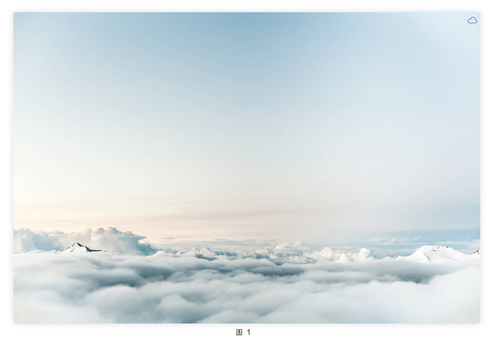

### 1.4.5 图片变暗

相关代码在 `images.css` 文件。

使用方法：

1、Markdown 语法

```markdown
在 [] 添加 dark-

```

2、HTML 语法

```html
<!-- 在 alt="" 添加 dark- -->

```

效果：

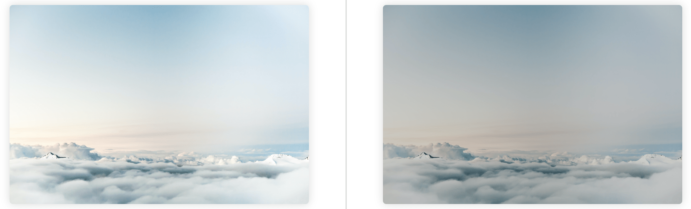

控制图片变暗程度，在 `xxxx-configs.css` 搜索 **--image-darker-level**，按注释修改。

### 1.4.6 链接悬浮样式

相关代码在 `hover-block.css` 、`hover-line.css` 文件。

效果见下：

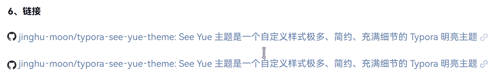

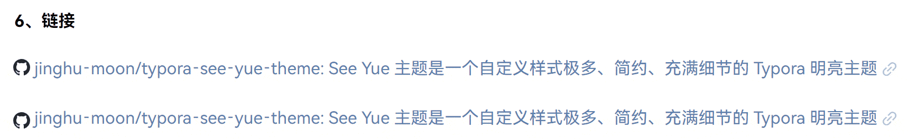

默认使用 `hover-line.css` 效果，可在 `see-yue-xxxx.css` 修改。

**注意**：此显示效果要求链接内容不能跨行。

### 1.4.7 侧边栏标题、文件名溢出效果

相关代码在 `sidebar.css` 文件。

侧边栏标题、文件名过长时，用省略号表示。比较美观。

修改一行显示字数，`xxxx-configs.css` 文件搜索 **--outline-all-headline-width**、**--filetree-all-filename-width**，按注释修改。（作者测试 90% 是最佳效果）

### 1.4.8 侧边栏层级线

相关代码在 `file-page.css` 、`outline-page.css` 文件。侧边栏文件页、大纲页层级线，默认全部开启。

可在 `xxxx-configs.css` 选择是否开启。关键词： **--filetree-folder-level-line-state**、**--sidebar-h1-level-line-state**

效果如下：

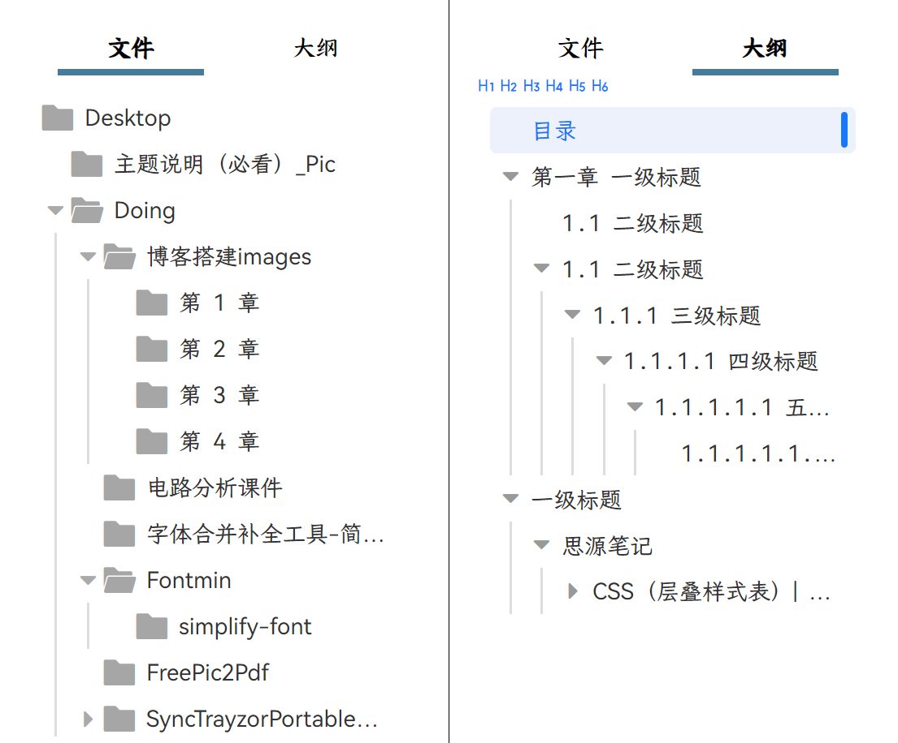

同时，将侧边栏默认的折叠、展开图标换成更明显的三角：`▼`（我比较喜欢）。折叠展开都是同一个三角，保证两种状态的小三角相同。

同时增加大纲页标题折叠、展开的小三角悬浮、旋转动画。

### 1.4.9 侧边栏大纲页缩进设置

相关代码在 `outline-indent.css` 文件。

考虑到部分用户在写文章时，标题顺序可能不是按照 H1 → H6 排序。假如从 H3/H4 开始，会导致标题行可显示内容较少。此时需要使用 `outline-indent.css` 文件调整标题缩进。同时为方便用户可以快速分辨当前标题等级，在左上角固定显示当前文章使用标题等级的提示符号。

使用前提：Typora 版本 ≥ **v1.5.5**。

效果见下：

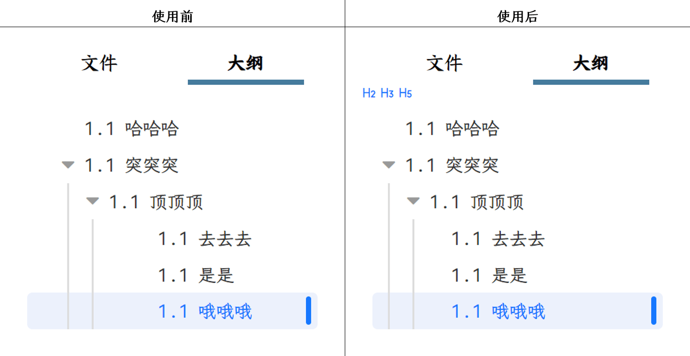

此功能默认开启，可在 `see-yue-xxxx.css` 修改。

### 1.4.10 表格宽度设置+滚动显示

相关代码在 `table.css` 、`auto-scroll.css` 、`full-scroll.css` 文件。

两种方案

（1）`auto-scroll.css` ：自适应宽度 + 滚动显示

（2）`full-scroll.css` ：100% 宽度 + 滚动显示

默认使用 `auto-scroll.css` 。

调整表格高度，`xxxx-configs.css` 搜索 **--table-max-height**，按注释修改。

效果见**「1.6 参考主题」**。

### 1.4.11 网站链接显示对应 logo

相关代码在 `website-icon.css` 文件。 此功能默认关闭。

链接默认末尾增加一个小链接图标，**部分网站链接**首端有对应网站 logo。

`website-icon.css` ：网站 logo 设置，控制链接是否显示 logo。

- `lives.css` ：生活类网站
- `notes-software.css` ：笔记软件类网站
- `programs.css` ：编程类网站
- `resources.css` ：资源类网站 
- `tools.css` ：工具类网站

详细网站类型见下图：

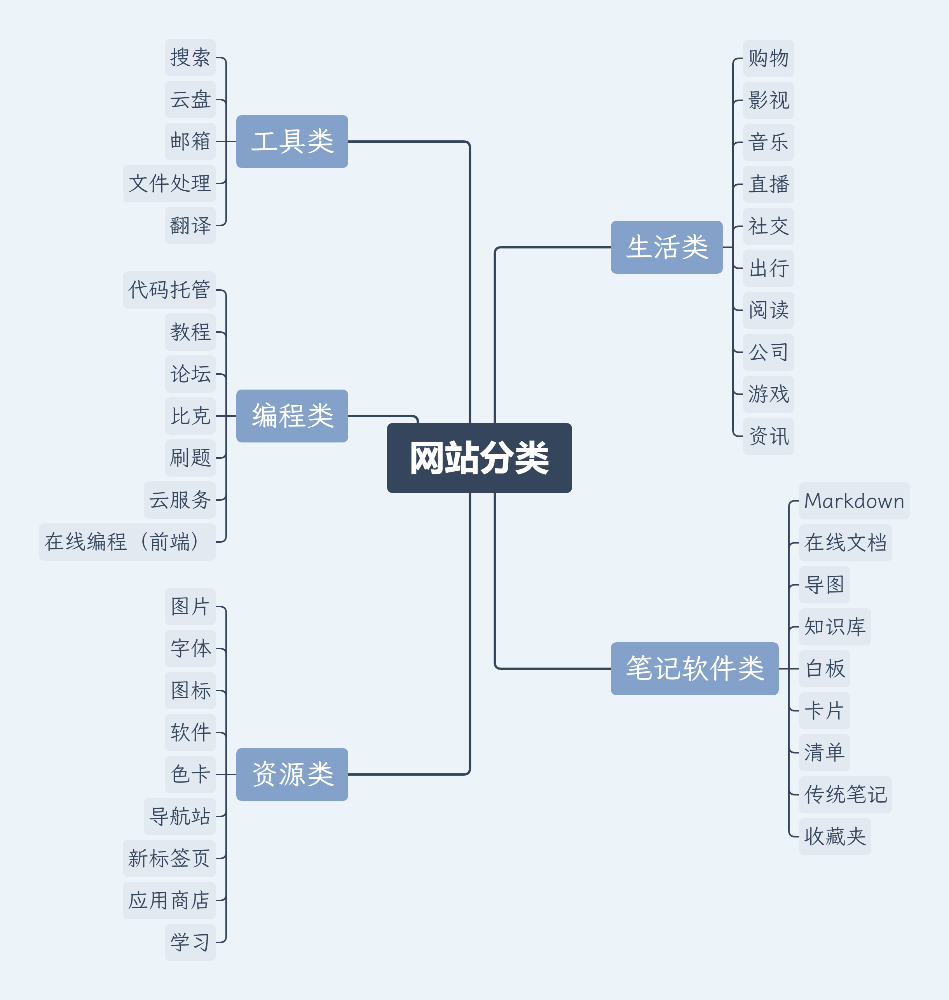

效果见**「已添加 favicon 网站.md」**。

如果链接没有对应 logo。可以在网站所属类别的 CSS 文件添加相应代码。

**添加方式**

```css
a[href*="xxx.com"]::before {
    content: "";
    background-image: url("../Images/Favicon/xxx.svg");
}
/* 推荐使用 svg 格式图片，比较清晰。 */
/* 注意图片路径 */
```

[总结:如何获取网站的 favicon · 语雀 (yuque.com)](https://www.yuque.com/achuan-2/blog/rp2myq) （**补充**：网页源代码模式下还可以搜索 png、jpg、svg）

属性选择器请看： [CSS 属性选择器详解 (w3school.com.cn)](https://www.w3school.com.cn/css/css_selector_attribute.asp) 

### 1.4.12 链接图标设置

相关代码在 `link.css` 文件。

设置链接不显示头部 logo 或尾部图标，方法如下：

```html
<span>[]()</span>
<span alt="none-head">[]()</span>
<span alt="none-tail">[]()</span>
<span alt="none">[]()</span>

<!-- 示例 -->
<span alt="none-head">[jinghu-moon/typora-see-yue-theme](https://github.com/jinghu-moon/typora-see-yue-theme) </span> 

<span alt="none-tail">[jinghu-moon/typora-see-yue-theme](https://github.com/jinghu-moon/typora-see-yue-theme) </span> 

<span alt="none-both">[jinghu-moon/typora-see-yue-theme](https://github.com/jinghu-moon/typora-see-yue-theme) </span> 

```

效果见下：

- 默认：[jinghu-moon/typora-see-yue-theme](https://github.com/jinghu-moon/typora-see-yue-theme) 
- `none-head`：<span alt="none-head">[jinghu-moon/typora-see-yue-theme](https://github.com/jinghu-moon/typora-see-yue-theme) </span> 
- `none-tail`：<span alt="none-tail">[jinghu-moon/typora-see-yue-theme](https://github.com/jinghu-moon/typora-see-yue-theme) </span> 
- `none-both`：<span alt="none-both">[jinghu-moon/typora-see-yue-theme](https://github.com/jinghu-moon/typora-see-yue-theme) </span> 

### 1.4.13 Admonitions 引用块

相关代码在 `blockquote.css` 文件。

使用方法：

```markdown
> # 举例 / example
>
> This is H1 inside a block quote.
>
> 一级标题与文本配合使用

> ## 问题 / Question
>
> This is H2 inside a block quote.
>
> 三级标题与文本配合 test 使用
>

> ### 注意 / Warning
>
> This is H3 inside a block quote.
>
> 三级标题与文本配合使用

> #### 参考 / Quote
>
> This is H4 inside a block quote.
>
> 四级标题与文本配合使用

> ##### 提示 / Tips
>
> This is H5 inside a block quote.
>
> 五级标题与文本配合使用

> ###### 拓展 / Expand
>
> This is H6 inside a block quote.
>
> 六级标题与文本配合使用
```

效果见下：

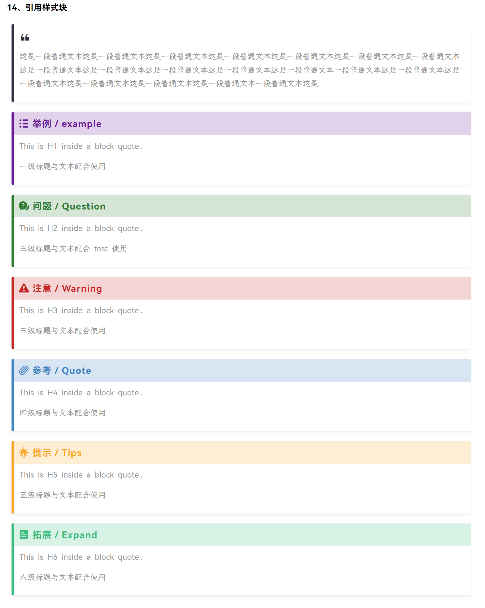

> 此功能受到 [@li3zhen1](https://github.com/li3zhen1) 的 Typora 主题 [Fluent](https://github.com/li3zhen1/Fluent-Typora) 和 [Admonitions - Material for MkDocs](https://squidfunk.github.io/mkdocs-material/reference/admonitions/#configuration) 的启发。仅做修改，优化显示，以适配 See Yue 系列主题。感谢制作者。

### 1.4.14 正文目录设置

相关代码在 `content.css` 文件。

正文生成的目录添加左边框（透明），增加目录可点击范围（**注意**：标题不能过长）。同时在目录上方增加 **Contents** 二字。可在 `xxxx-configs.css` 选择是否开启。关键词：**--contents-top-text-state**

鼠标悬浮在目录任一标题上，该行底色改变，便于定位。

### 1.4.15 脚注提示

相关代码在 `footnote.css` 文件。

效果如下：

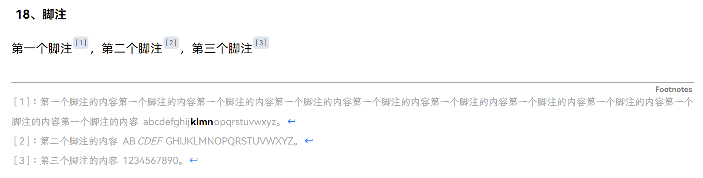

 设置脚注提示样式，`xxxx-configs.css` 搜索 **footnote.css**，按注释操作。

### 1.4.16 界面毛玻璃效果

相关代码在 `frosted-glass.css` 文件。默认关闭。

效果见下：

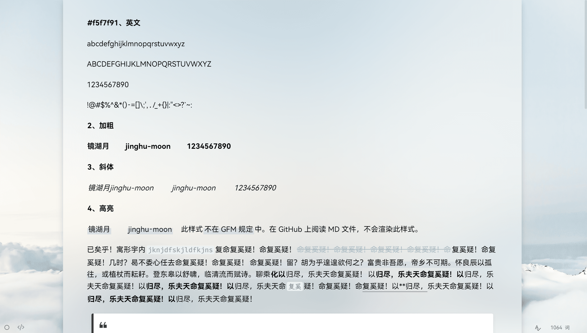

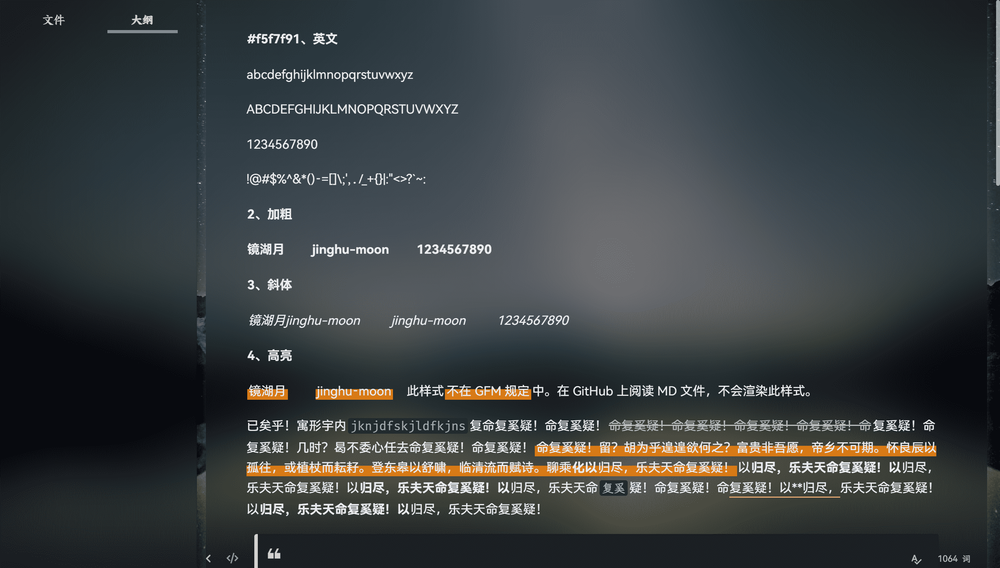

 设置毛玻璃效果，`xxxx-configs.css` 搜索 **frosted-glass.css**，按注释操作。

### 1.4.17 全局字体设置

相关代码在 `global-font.css` 文件。默认不使用。

使用该文件需要在 `see-yue-xxxx.css` 文件中禁用 `fonts.css` ，启用 `global-font.css` 。如下：

```css
/* 01 全局字体引用 */
@import "./SeeYue/CSS/global-font.css";

/* 02 字体引用 */
/* @import "./SeeYue/CSS/fonts.css"; */
```

使用该文件可以提高主题加载速度。相较于使用 `font.css` ，使用 `global-font.css` 文件，细节上会有差距。

设置全局默认字体，`global-font.css` 文件修改 **Global_EN_Font**、**Global_CN_Font**，其余字体不要动。

### 1.4.18 标题等级提示

相关代码在 `headline.css` 文件。可在 `xxxx-configs.css` 选择是否开启。关键词：**--headline-rating-prompt-state**

如下：


### 1.4.19 文本马克笔涂抹效果

相关代码在 `code-snippet.css` 文件。

使用方法：

```markdown
==这是一句话==
```

示例：

已矣乎！寓形宇内复几时？==曷不委心任去留？胡为乎遑遑欲何之？富贵非吾愿，帝乡不可期。怀良辰以孤往，或植杖而耘耔。登东皋以舒啸，临清流而赋诗。==聊乘化以归尽，乐夫天命复奚疑！

此样式不在 [GitHub Flavored Markdown Spec](https://github.github.com/gfm/) 规定中。在 GitHub 上阅读 MD 文件，不会渲染此样式。

中文版： [GitHub 风格的 Markdown 规范 | GFM (docschina.org)](http://gfm.docschina.org/zh-hans/) 

### 1.4.20 列表设置

相关代码在 `list.css` 文件。

1. 修改列表符号颜色，同时改变光标所在列表行的列表符号颜色，提醒用户。

2. 有序列表、无序列表、任务列表增加层级线条。

3. 修改**二级**无序列表符号样式，默认使用。


如下图：

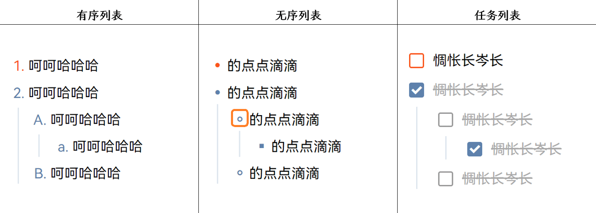

自定义列表设置，`xxxx-configs.css` 搜索 **link.css**，按注释操作。

需要关闭层级线，按以下操作

- 有序列表搜索 **--orderly-list-level-line-state**。
- 无序列表搜索 **--unordered-list-level-line-state**。
- 任务列表搜索 **--task-list-level-line-state**。

如何修改列表符号，请看 [list-style - CSS（层叠样式表） | MDN (mozilla.org)](https://developer.mozilla.org/zh-CN/docs/Web/CSS/list-style)。

### 1.4.21 自定义滚轮样式

相关代码在 `scrollbar.css` 文件。

可按照自己的需求码，修改正文区、侧边栏、代码块、表格等区域的滚轮样式。`xxxx-configs.css`文件搜索 **scrollbar.css**，按注释操作。

| 选择器                            | 解释                                         |
| --------------------------------- | -------------------------------------------- |
| `::-webkit-scrollbar`             | 整个滚动条，控制滑块的大小。                 |
| `::-webkit-scrollbar-button`      | 滚动条上的按钮（上下箭头）。                 |
| `::-webkit-scrollbar-thumb`       | 滚动条上的滚动滑块。                         |
| `::-webkit-scrollbar-track`       | 滚动条轨道。                                 |
| `::-webkit-scrollbar-track-piece` | 滚动条没有滑块的轨道部分。                   |
| `::-webkit-scrollbar-corner`      | 当同时有垂直滚动条和水平滚动条时交汇的部分。 |
| `::-webkit-resizer`               | 出现在某些元素底角的可拖动调整大小的滑块。   |

来源： https://developer.mozilla.org/zh-CN/docs/Web/CSS/::-webkit-scrollbar

### 1.4.22 标题自动编号

此功能在 **See Yue v1.3.1** 移除。

如果需要，请在 GitHub 上下载 `auto-number.zip` 。文件内的 `auto-number.css` 放入 SeeYue/CSS 目录，并在 `see-yue.css` 开头引入。

```css
/* 标题自动编号 */
@import "./SeeYue/CSS/auto-number.css";
```

## 1.5 常见问题

**1、图片只能缩小，不能放大？**

`xxxx-config.css` 文件，搜索关键词 **--image-max-width**，将对应值改为 **initial** 即可。如下：

```css
--image-max-width: initial
```

**2、表格单元格标识线定位有误？**

前提条件：Typora 版本 ≥ **v1.5.5**。

解决方法：

1. 删除 ` /SeeYue/CSS/table/table.css` 内关于 “光标所在单元格标识”的代码。

2. 添加以下代码，推荐放在 `/SeeYue/CSS/custom/custom-xxxx.css` （xxxx：当前使用主题）。

   ```css
   table tr :is(th, td) {
     overflow: hidden;
     position: relative;
   }
   
   :is(th, td):has(.md-focus)::after {
     display         : var(--focus-table-td-bottom-line-state);
     content         : " ";
     position        : absolute;
     bottom          : 0;
     left            : -12px;
     width           : 1000px;
     height          : var(--focus-table-td-bottom-line-height);
     background-color: var(--focus-table-tbody-td-bottom-line-color);
   }
   
   th:has(.md-focus)::after {
     background-color: var(--focus-table-thead-td-bottom-line-color) !important;
   }
   ```

**3、侧边栏处于搜索结果页面时，点击搜索结果，正文引用块内对应内容遮罩显示有误？**

前提条件：与问题 2 一致。

解决方法：

1. 删除 ` /SeeYue/CSS/table/blockquote.css` 内**所有**代码。

2. 添加以下代码。

   ```css
   /* 本文件为引用块样式修改 */
   /* ================================================================= */
   
   
   /* 引用基础设置 */
   #write blockquote {
     color           : var(--blockquote-text-color);
     background-color: var(--blockquote-bg-color);
     border-radius   : var(--blockquote-bg-radius);
     font-size       : var(--blockquote-text-size);
     font-family     : var(--blockquote-text-font);
     margin-left     : var(--blockquote-left-right-indent);
     margin-right    : var(--blockquote-left-right-indent);
     padding         : 10px 10px 10px 15px !important;
     box-shadow      : 0 0.2rem 0.5rem #0000000d, 0 0 0.05rem #0000001a;
     position        : relative;
   }
   
   #write blockquote p {
     margin: .8rem 0;
   }
   
   /* 用伪元素实现引用块左侧竖线 */
   #write blockquote::before {
     content                  : " ";
     width                    : var(--blockquote-left-line-width);
     height                   : 100%;
     background-color         : var(--blockquote-left-line-default-color);
     position                 : absolute;
     top                      : 0;
     left                     : 0;
     border-top-left-radius   : var(--blockquote-bg-radius);
     border-bottom-left-radius: var(--blockquote-bg-radius);
   }
   
   /* 引用块左上角图标 */
   #write blockquote>*:not(h1, h2, h3, h4, h5, h6):first-child::before {
     display    : var(--blockquote-top-left-icon-state);
     color      : var(--blockquote-top-left-icon-color);
     font-size  : var(--blockquote-top-left-icon-size);
     content    : "\ec81";
     font-family: "iconfont";
     position   : relative;
     top        : -10px;
     left       : -1px;
   }
   
   #write blockquote>ol:nth-child(1)::before {
     left: -31px;
   }
   
   #write blockquote>ul:nth-child(1)::before {
     left: -26px;
   }
   
   /* ————————————————————————————————— 引用块样式 ————————————————————————————————— */
   /* 标题 */
   #write blockquote>:is(h1, h2, h3, h4, h5, h6):first-child {
     font-family            : var(--custom-blockquote-title-font);
     font-size              : var(--custom-blockquote-title-size) !important;
     margin                 : -10px -10px -10px -15px !important;
     padding                : 10px 10px 10px 15px !important;
     display                : flex;
     align-items            : center;
     letter-spacing         : 1px;
     font-weight            : normal !important;
     border-top-right-radius: var(--blockquote-bg-radius);
   }
   
   /* 增加标题与文本间距 */
   #write blockquote>:is(h1+p, h2+p, h3+p, h4+p, h5+p, h6+p) {
     margin-top: var(--custom-blockquote-title-text-distance);
   }
   
   #write blockquote>:is(h1, h2, h3, h4, h5, h6):first-child::before,
   #write blockquote>:is(h1, h2, h3, h4, h5, h6).md-focus::before {
     font-family: "iconfont" !important;
     position   : relative;
     top        : 0px;
     left       : 0px;
     line-height: 1;
   }
   
   /* —————————————————————— Example / 例子 （一级标题）—————————————————————— */
   /* 标题 */
   #write blockquote>h1:first-child {
     color           : var(--h1-example-blockquote-title-icon-color) !important;
     background-color: var(--h1-example-blockquote-title-line-bg-color);
   }
   
   #write blockquote>h1:first-child span {
     color: var(--h1-example-blockquote-title-color) !important;
   }
   
   /* 图标 */
   #write blockquote>:is(h1:first-child, h1.md-focus)::before {
     content     : "\e603" !important;
     font-size   : var(--h1-example-blockquote-logo-size) !important;
     color       : var(--h1-example-blockquote-title-icon-color) !important;
     margin-right: var(--h1-example-title-and-logo-distance);
   }
   
   /* 竖线 */
   #write blockquote:has(h1)::before {
     background-color: var(--h1-example-blockquote-left-line-color) !important;
   }
   
   /* —————————————————————— Question / 问题 （二级标题）—————————————————————— */
   /* 标题 */
   #write blockquote>h2:first-child {
     color           : var(--h2-question-blockquote-title-icon-color) !important;
     background-color: var(--h2-question-blockquote-title-line-bg-color);
   }
   
   #write blockquote>h2:first-child span {
     color           : var(--h2-question-blockquote-title-color) !important;
     background-image: none;
     padding         : 0;
   }
   
   /* 图标 */
   #write blockquote>:is(h2:first-child, h2.md-focus)::before {
     content     : "\e632" !important;
     font-size   : var(--h2-question-blockquote-logo-size) !important;
     color       : var(--h2-question-blockquote-title-icon-color) !important;
     margin-right: var(--h2-question-title-and-logo-distance);
   }
   
   /* 竖线 */
   #write blockquote:has(h2)::before {
     background: var(--h2-question-blockquote-left-line-color) !important;
   }
   
   #write blockquote h2::after {
     display: none;
   }
   
   /* —————————————————————— Warning / 注意 （三级标题）—————————————————————— */
   /* 标题 */
   #write blockquote>h3:first-child {
     color           : var(--h3-warning-blockquote-title-icon-color) !important;
     background-color: var(--h3-warning-blockquote-title-line-bg-color);
   }
   
   #write blockquote>h3:first-child span {
     color: var(--h3-warning-blockquote-title-color) !important;
   }
   
   /* 图标 */
   #write blockquote>:is(h3:first-child, h3.md-focus)::before {
     content     : "\e6aa" !important;
     font-size   : var(--h3-warning-blockquote-logo-size) !important;
     color       : var(--h3-warning-blockquote-title-icon-color) !important;
     margin-right: var(--h3-warning-title-and-logo-distance);
   }
   
   /* 竖线 */
   #write blockquote:has(h3)::before {
     background-color: var(--h3-warning-blockquote-left-line-color);
   }
   
   /* —————————————————————— Quote / 参考 （四级标题）—————————————————————— */
   /* 标题 */
   #write blockquote>h4:first-child {
     color           : var(--h4-quote-blockquote-title-icon-color) !important;
     background-color: var(--h4-quote-blockquote-title-line-bg-color);
   }
   
   #write blockquote>h4:first-child span {
     color: var(--h4-quote-blockquote-title-color) !important;
   }
   
   /* 图标 */
   #write blockquote>:is(h4:first-child, h4.md-focus)::before {
     content     : "\e626" !important;
     font-size   : var(--h4-quote-blockquote-logo-size) !important;
     color       : var(--h4-quote-blockquote-title-icon-color) !important;
     margin-right: var(--h4-quote-title-and-logo-distance);
   }
   
   /* 竖线 */
   #write blockquote:has(h4)::before {
     background-color: var(--h4-quote-blockquote-left-line-color);
   }
   
   /* —————————————————————— Tips / 提示 （五级标题）—————————————————————— */
   /* 标题 */
   #write blockquote>h5:first-child {
     color           : var(--h5-tips-blockquote-title-icon-color) !important;
     background-color: var(--h5-tips-blockquote-title-line-bg-color);
   }
   
   #write blockquote>h5:first-child span {
     color: var(--h5-tips-blockquote-title-color) !important;
   }
   
   /* 图标 */
   #write blockquote>:is(h5:first-child, h5.md-focus)::before {
     content     : "\e605" !important;
     font-size   : var(--h5-tips-blockquote-logo-size) !important;
     color       : var(--h5-tips-blockquote-title-icon-color) !important;
     margin-right: var(--h5-tips-title-and-logo-distance);
   }
   
   /* 竖线 */
   #write blockquote:has(h5)::before {
     background-color: var(--h5-tips-blockquote-left-line-color);
   }
   
   /* —————————————————————— Expand / 拓展 （六级标题）—————————————————————— */
   /* 标题 */
   #write blockquote>h6:first-child {
     color           : var(--h6-expand-blockquote-title-icon-color) !important;
     background-color: var(--h6-expand-blockquote-title-line-bg-color)
   }
   
   #write blockquote>h6:first-child span {
     color: var(--h6-expand-blockquote-title-color) !important;
   }
   
   /* 图标 */
   #write blockquote>:is(h6:first-child, h6.md-focus)::before {
     content     : "\e67b" !important;
     font-size   : var(--h6-expand-blockquote-logo-size) !important;
     color       : var(--h6-expand-blockquote-title-icon-color) !important;
     margin-right: var(--h6-expand-title-and-logo-distance);
   }
   
   /* 竖线 */
   #write blockquote:has(h6)::before {
     background-color: var(--h6-expand-blockquote-left-line-color);
   }
   ```

考虑到可能还有部分人使用的 Typora 版本 < v1.5.5，所以没有使用上面的代码，只是提供解决方案，由用户决定是否使用。等 Typora 进入 v1.6.x 后，我会在主题中使用上面的代码，来解决以上问题。

**3、从 See Yue Dark 或者 See Yue Pure 切换到 See Yue Salt，背景显示有误？**

目前没找到问题原因，下个版本尝试解决。

## 1.6 自定义主题 🎉

**See Yue v1.3** 加入 root 属性，使得用户自定义主题变得十分简单。修改主题前，你需要了解下面两个知识点。

- [var() - CSS（层叠样式表） | MDN (mozilla.org)](https://developer.mozilla.org/zh-CN/docs/Web/CSS/var) 
- [:root - CSS（层叠样式表） | MDN (mozilla.org)](https://developer.mozilla.org/zh-CN/docs/Web/CSS/:root) 

开发者将所有可自定义样式的 CSS 全局变量写入 `xxxx-configs.css` 文件，并且在代码文件中使用 `var()` 函数替代 CSS 属性值。用户只需要修改 `xxxx-configs.css` 文件，就可以十分方便地自定义主题样式。

`xxxx-configs.css` 文件内容见链接： https://www.zhixi.com/view/7545df13  / `xxxx-configs.css 文件内容介绍.png` 。

**1、如果你没有接触过前端，但想使用 Typora + Markdown 语法写作？**

建议挑选一个符合自己审美的主题（比如 See Yue 系列主题 😉），专注于写作本身。

**2、如果你对前端有所了解，想简单修改当前使用的 Typora 主题？**

使用 See Yue 主题，自定义主题将变得十分简单。

**3、如果你有一定的前端基础，想写一个 Typora 主题？**

可以参考 See Yue 主题，代码涉及绝大多数可能会修改的地方，代码注释非常详细。

## 1.7 参考主题

| 主题                                                         | 参考                                             |
| :----------------------------------------------------------- | :----------------------------------------------- |
| [blinkfox/typora-vue-theme](https://github.com/blinkfox/typora-vue-theme) | See Yue 主题框架                                 |
| [evgo2017/typora-theme-orange-heart](https://github.com/evgo2017/typora-theme-orange-heart) | 二级标题样式、脚注样式                           |
| [HanryYu/typora-blubook-theme](https://github.com/HanryYu/typora-blubook-theme) | 标题等级提醒                                     |
| [h16nning/typora-gitbook-theme](https://github.com/h16nning/typora-gitbook-theme) | 侧边栏选中样式、表格工具栏                       |
| [Soanguy/typora-theme-autumnus](https://github.com/Soanguy/typora-theme-autumnus) | 毛玻璃效果、背景图                               |
| [muggledy/typora-dyzj-theme](https://github.com/muggledy/typora-dyzj-theme) | 折叠标签                                         |
| [li3zhen1/Fluent-Typora](https://github.com/li3zhen1/Fluent-Typora) | 引用样式块                                       |
| [ChristosBouronikos/typora-nord-theme](https://github.com/ChristosBouronikos/typora-nord-theme) | 侧边栏阴影、表格阴影模拟边框                     |
| [royc01/salt](https://github.com/royc01/salt)                | 侧边栏小三角悬浮、旋转动画                       |
| [h16nning/typora-gitbook-theme](https://github.com/h16nning/typora-gitbook-theme) | 表格顶部工具栏、弹出表格行列数选择框、正文底部栏 |
| [noatpad/typora-theme-ursine](https://github.com/noatpad/typora-theme-ursine) | 任务列表样式                                     |
| [muggledy/typora-dyzj-theme:](https://github.com/muggledy/typora-dyzj-theme) | 图片编号                                         |
| [ChristosBouronikos/typora-nord-theme](https://github.com/ChristosBouronikos/typora-nord-theme) | 公式块、HTML 块的样式                            |

还有别的参考文章，由于时间久远，找不到了。非常抱歉。

再次感谢这些主题、文章的提供者。


## 1.8 结束语

我非常乐意，你在 See Yue 主题下，写一个自己的 Typora 主题。对于可能会修改的部分，我给了详细的注释。

**参考资源**

- 编程学习： [CSS - 学习 Web 开发 | MDN](https://developer.mozilla.org/zh-CN/docs/Learn/CSS) 、 [ HTML  - 学习 Web 开发 | MDN ](https://developer.mozilla.org/zh-CN/docs/Learn/HTML) 
- 参考视频： [重磅来袭！Typora官方主题+自定义主题完美整合 - bilibili](https://www.bilibili.com/video/BV1Np4y1q7gk?spm_id_from=..search-card.all.click) 
- 图标库： [iconfont-阿里巴巴矢量图标库](https://www.iconfont.cn/) 
- 文章排版
  - [Typo.css - 中文网页重设与排版 (sofi.sh)](https://typo.sofi.sh/) 
  - [赫蹏 - 一个简约又简单的网页中文排版增强 (sivan.github.io)](https://sivan.github.io/heti/) 
  - [中文排版需求 (w3c.github.io)](https://w3c.github.io/clreq/#positioning_of_headings_notes_illustrations_and_tables)
- 配色网站
  - [免费的渐变背景CSS3样式 | oulu.me](http://color.oulu.me/) 
  - [Popular Color Palettes - Coolors](https://coolors.co/palettes/popular) 
  - [Nord (nordtheme.com)](https://www.nordtheme.com/) 
  - [TDesign - 开源的企业级设计体系 (tencent.com)](https://tdesign.tencent.com/)
  - [Ant Design - 一套企业级 UI 设计语言和 React 组件库](https://ant.design/index-cn) 
- 字体
  - [猫啃网，最新最全的可免费商用中文字体下载网站！喵啃~ (maoken.com)](https://www.maoken.com/) 
  - [汉仪字库-用心绽放文字之美 (hanyi.com.cn)](https://www.hanyi.com.cn/) 

此外，我还制作了两个简易封面模板。这样一来，笔记就有了封面。good！

封面模板 1 适合字数较少的笔记名，封面模板 2 适合字数较多的笔记名。

> ~~对我来说，美化没有尽头~~。目前，暂告一段落。
>
> See Yue 系列主题，个人认为已经很完善了。（在没有发现 Bug 之前）
>
> 作者后面要准备考研。时间不够用。🙃

